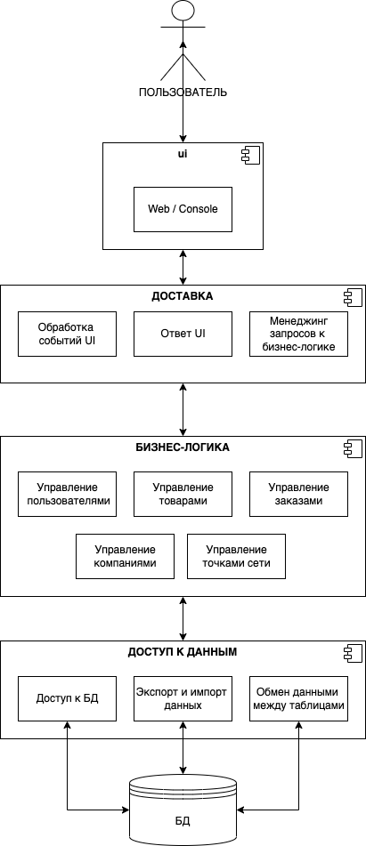

# Зоомагазин

# Лабораторная работа №1

## Краткое описание идеи проекта

Необходимо реализовать базу данных, предоставить интерфейс для доступа к данным, а также пользовательский интерфейс, реализующий функционал для выделенных ролей.

В качестве пользователей были выделены Работники, Частные Клиенты (физ. лица) и Бизнес Клиенты (юр. лица). В связи с чем выделены следующие пункты необходимого функционала:

1. Для Частного и Бизнес Клиентов:

- возможность просмотреть список товаров и их доступность в точках сети магазина
- возможность конкретно ознакомиться с каждым из товаров в его карточке
- возможность оформить заказ с получением в одной из точек сети

2. Для Работников:

- возможность просмотреть все заказы
- возможность менять статус заказа
- возможность редактировать всю информацию (для Работника-админа)

## Краткое описание предметной области

Предметная область - купля-продажа зоотоваров. Крупная торговая сеть предоставляет возможность покупки зоотоваров Частным Клиентам и Бизнес Клиентам с помощью веб-приложения. Для совершения покупки Частный Клиент или Бизнес Клиент должен быть зарегистрирован и авторизован. При оформлении заказа необходимо выбрать пункт выдачи, для Бизнес Клиентов дополнительно выбрать компанию, от лица которой будет совершен заказ.

## Краткий анализ аналогичных решений

| Название    | Работа с юр. лицами | Бонусная программа | Личный кабинет | Вариативность доставки |
| :---------- | :-----------------: | :----------------: | :------------: | :--------------------: |
| Четыре лапы |          -          |         +          |       +        |           +            |
| Бетховен    |          +          |         +          |       +        |           +            |
| Magizoo     |          +          |         -          |       +        |           +            |

## Краткое обоснование целесообразности и актуальности проекта

Необходимо обеспечить связь между производителями товаров для животных и конечными потребителями. В текущих реалиях наиболее удобный и актуальный формат для решения поставленной задачи - онлайн-формат.

## Use-case диаграмма

## ER-диаграмма сущностей

# Лабораторная работа №2

## Описание типа приложения и выбранного технологического стека

Тип приложения - Web SPA

Технологический стек - TypeScript, Jest, VueJs, PostgreSQL

## Верхнеуровневое разбиение на компоненты

## UML диаграммы классов для двух отдельных компонентов - компонента доступа к данным и компонента с бизнес-логикой

## Сущности БД

